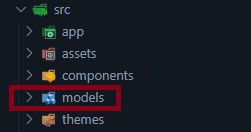
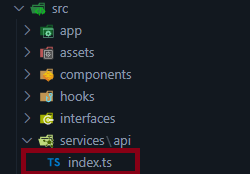
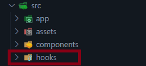

[](https://opensource.org/licenses/MIT)

### <a target="_blank" href="https://www.raulalbuquerque.com/">www.raulalbuquerque.com</a>

#### Documentation | Documentação:
- [English](#portfolio)
- [Português](#portfólio)
<br><br>

#  Portfolio 

* This is my portfolio and it was developed with Next.js to improve my knowledges about this framework.

* This application have many features like dark & light theme, language switch between english & portuguese, responsive layout and components with visual feedback.

## Techs:
[](https://skillicons.dev)

## Responsive Layout

<table style="border: none;">
    <tr>
        <th style="text-align: center;">Mobile Layout</th>
        <th style="text-align: center;">Tablet Layout</th>
    </tr>
    <tr>
        <td>
            
        </td>
        <td>
            
        </td>
    </tr>
</table>

## Routes

- **"/"** : home page with the name and tech stack of developer.
- **"/about"**: page with informations about the developer.
- **"/projects"**: page with the developer's main projects.
- **"/freelances"**: page with the most revelant real projects as a freelancer.
- **"/contacts"**: contact page.

## Installation

### Fork this repository

 

### Customize it with your data

The application has two features to render the data:
    
- Getting your data from a [Static File](#static-file)
- Getting your data from a [API REST](#api-rest)

### Static file

1. **Clone the "main" branch**

    ```shell
    git clone git@github.com:Raul-Albuquerque/portfolio-2.0.git . --branch  main --single-branch
    ```

2. **Install dependencies**

    ```shell
    npm install
    ```

3. **Access the models folder**

     

4. **Update the models with your informations**

    

5. **Replace the static images**

     

6. **Start the development server**

    ```shell
    npm run dev
    ```
7. Open [http://localhost:3000](http://localhost:3000) in your browser.

### API REST

In order to get your data from an API REST you have to use the "rest-api" branch.

1. **Clone the "rest-api" branch**

    ```shell
    git clone git@github.com:Raul-Albuquerque/portfolio-2.0.git . --branch 
    rest-api --single-branch
    ```
2. **Install dependencies**

    ```shell
    npm install
    ```

3. **Access the api folder and open the index.ts file**

    

4. **Replace the baseURL within index.ts file**

    ```javascript
    import axios from 'axios'

    const api = axios.create({
    baseURL: 'https://api-portfolio-2-0.onrender.com',
    })

    export default api
    ``` 
5. **Open the files within hooks folder**

    

6. **Check the endpoints** 
    ```javascript
    const fetchData = async (): Promise<DeveloperResponse> => {
    const response = await api.get<DeveloperResponse>('/developers')
    return response.data
    }

    // Make sure that the endpoint of your REST API matches the endpoint of your hooks.
    ``` 
7. **Start the development server**

    ```shell
    npm run dev
    ```

8. Open [http://localhost:3000](http://localhost:3000) in your browser.

## Contribution

Contributions are welcome! Feel free to open a PR or report issues.

If you found this project helpful, consider dropping a star (⭐) on the repo to help it grow!

## Author
This project was created by [Raul Albuquerque](http://localhost:3000).

## Contact
For more information of collaborations on the project, please contact [raulmalbuquerque2014@gmail.com](mailto:raulmalbuquerque2014@gmail.com).
<br><br>
<hr>
<br><br>

 

# Portfólio
Esse é o meu portfolio e ele foi desenvolvido com Next.js para aprimorar meus conhecimentos nesse framework.

Esta aplicação tem diversas funcionalidades como temas claro e escuro, mudança de idioma entre inglês e português, layout responsivo e components com feedback visual.

## Tecnologias:
[](https://skillicons.dev)

## Layout responsivo

<table style="border: none;">
    <tr>
        <th style="text-align: center;">Layout no celular</th>
        <th style="text-align: center;">Layout no tablet</th>
    </tr>
    <tr>
        <td>
            
        </td>
        <td>
            
        </td>
    </tr>
</table>

## Rotas

- **"/"** : página inicial com o nome e a stack do desenvolvedor(a).
- **"/about"**: página com informações sobre o desenvolvedor(a).
- **"/projects"**: página com os principais projetos do desenvolvedor(a).
- **"/freelances"**: página com os projetos reais mais revelantes como freelancer.
- **"/contacts"**: página de contato.

## Instalação

### Fork o repositório

 

### Personalize com seus dados

A aplicação possui duas funcionalidades para renderizar os dados:
    
- Consumindo dados de um [Arquivo Estático](#arquivo-estático)
- Consumindo dados de uma [API REST](#rest-api)

### Arquivo Estático

1. **Clone a branch "main"**

    ```shell
    git clone git@github.com:Raul-Albuquerque/portfolio-2.0.git . --branch  main --single-branch
    ```

2. **Instale as dependências**

    ```shell
    npm install
    ```

3. **Acesse a pasta models**

     

4. **Atualize os modelos com suas informações**

    

5. **Substitua as images estáticas**

     

6. **Inicie o servidor de desenvolvimento**

    ```shell
    npm run dev
    ```
7. Abra [http://localhost:3000](http://localhost:3000) em seu browser.

### REST API

Para exibir seus dados consumindo uma API REST você tem que usar a branch "rest-api".

1. **Clone a branch "rest-api"**

    ```shell
    git clone git@github.com:Raul-Albuquerque/portfolio-2.0.git . --branch 
    rest-api --single-branch
    ```
2. **Instale as dependências**

    ```shell
    npm install
    ```

3. **Acesse a pasta "api" e abra o arquivo index.ts**

    

4. **Substitua a baseURL no arquivo index.ts**

    ```javascript
    import axios from 'axios'

    const api = axios.create({
    baseURL: 'https://api-portfolio-2-0.onrender.com',
    })

    export default api
    ``` 
5. **Abra os arquivos dentro da pasta hooks**

    

6. **Confira os endpoints** 
    ```javascript
    const fetchData = async (): Promise<DeveloperResponse> => {
    const response = await api.get<DeveloperResponse>('/developers')
    return response.data
    }

    // Verifique se o endpoint da sua REST API é igual ao endpoint dos seus hooks.
    ``` 
7. **Inicie o servidor de desenvolvimento**

    ```shell
    npm run dev
    ```
8. Abra [http://localhost:3000](http://localhost:3000) em seu browser.

## Contribuições
Contribuições são bem-vindas! Sinta-se livre para abrir um PR ou informar erros.

Se esse projeto ajudou você, considere deixar uma estrela (⭐) neste respositório para ajudá-lo a crescer.

## Autor
Este projeto foi criado por [Raul Albuquerque](http://localhost:3000).

## Contato
Para mais informações ou colaborações com o projeto, entre em contato por [raulmalbuquerque2014@gmail.com](mailto:raulmalbuquerque2014@gmail.com).
